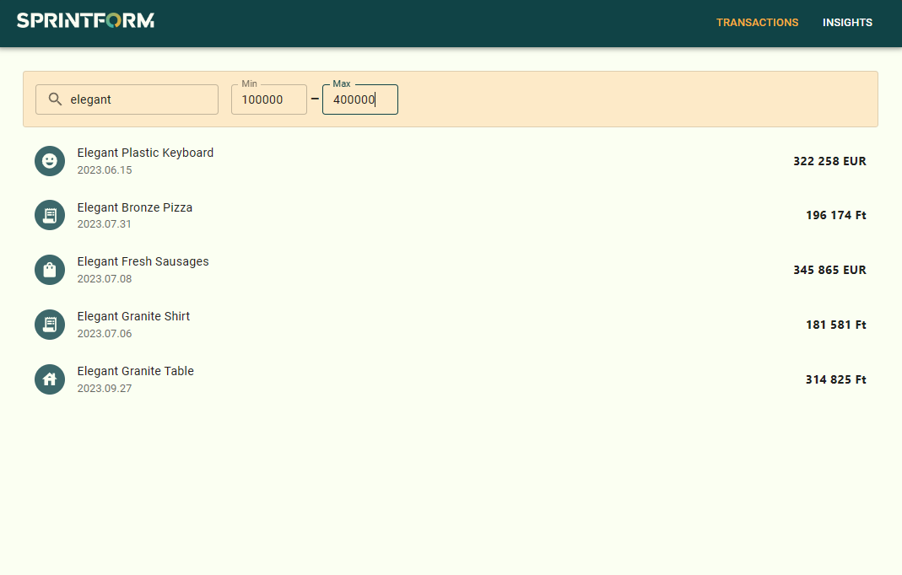
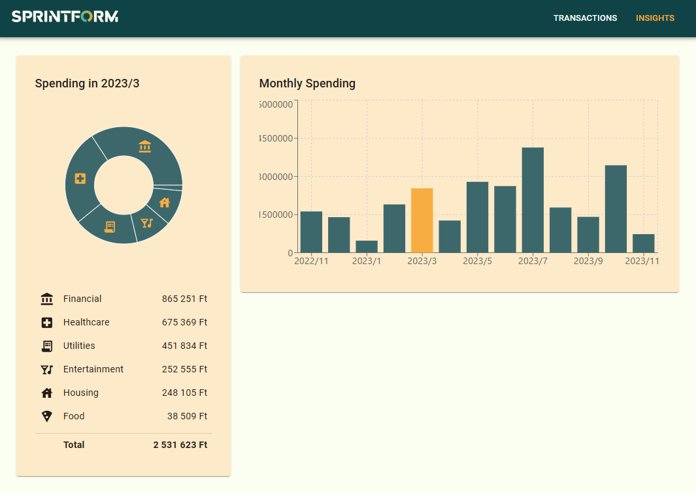

# Sprintform Homework

## Overview

<p float="left">
 
 
</p>

This is a simple web application for managing the finances of Sprintform.

Supported features:
- Listing and filtering transactions (free text search and amount range)
- Insights view with monthly spending and category breakdown

Hidden technical features:
- Infinite scrolling
- Responsive design
- MUI theme customization
- Transitions

Known issues:
- The insights page and the statistic endpoints don't handle different currencies correctly.
- The list page isn't fully optimized for mobile devices.
- While the backend supports create/edit/delete operations, these are not implemented in the frontend.

## Architecture

The application is split into two parts:
- Frontend (React)
- Backend (Node.js)

The frontend is a single page application that communicates with the backend via a REST API. 

The backend is a Node.js server application powered by the API Core framework. It uses the following API Core modules:
- `api-provider-express` - For exposing the REST API using Express.js
- `api-model-mongoose` - For connecting to MongoDB
- `api-core-mapper` - For providing Swagger and OpenAPI schema files
- `api-provider` - For connecting the modules together
- `api-core` - For handling API queries and responses

## Local setup

To run locally, you will need the following environment:
- Node.js 20.9.0 (LTS)
- Typescript 5.x
- MongoDB 7.x

### Frontend

Create the `.env.local` file in the `frontend` directory with the following content:
```dotenv
VITE_API_URI=http://localhost:8080
```

Then install the dependencies and run the development server:
```bash
cd frontend
yarn
yarn dev
```

### Backend

Install the dependencies:
```bash
cd backend
yarn
```

Before starting the server for the first time, seed the database with demo data:
```bash
yarn seed
```

Finally run the server:
```bash
yarn start
```

## Deployment

When deploying the system, you can use the `PORT` and `MONGODB_URI` environment variables to configure the server.